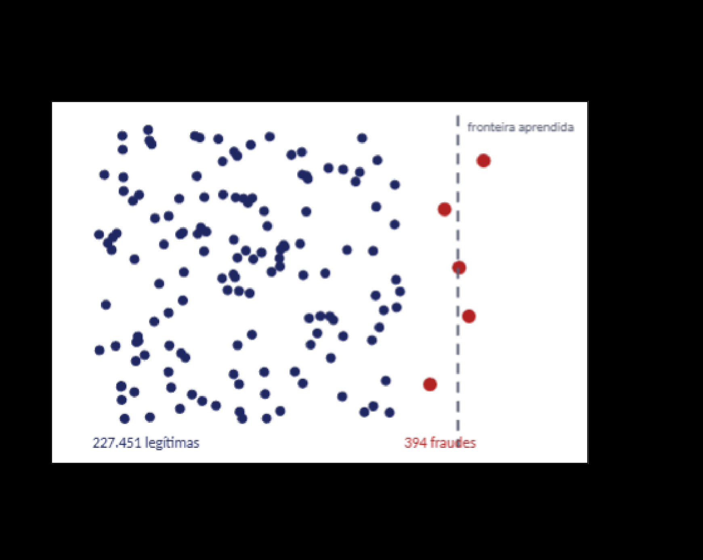
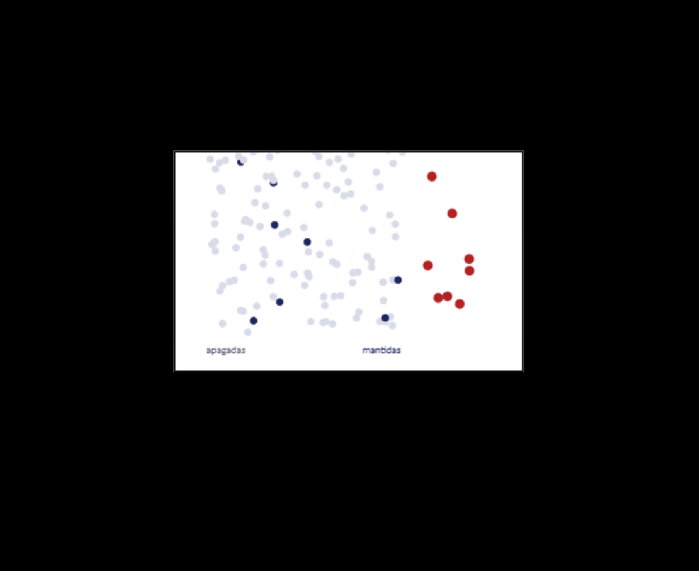

# Aula 07 — Detecção de fraude e dados desbalanceados

## p01 · Capa

```text
analista@insper:~$ python treinar.py creditcard.csv
[*] 284.807 transações · 492 fraudes (0,172%)
model> acurácia: 0.9983
model> fraudes detectadas: 0 / 98
# acurácia alta, modelo inútil
>>> LogisticRegression(class_weight="balanced")
>>>
```

## p02 · Do sinal à avaliação séria — *ONDE ESTAMOS NA ESCADA*

Escada da disciplina (da esquerda para a direita):

| Roteiro 1 | Roteiro 2 | **HOJE · Aula 7** | Aula 8 | Roteiro 3 · Aula 10 |
|---|---|---|---|---|
| Sinais de log à mão (heurística) | Sinais viram features de um classificador | O problema que o R2 escondeu: **classes raras** | Métricas: precisão, recall, F1, curvas | Avaliação séria: limiar e custo de FP e FN |

No Roteiro 2 o CICIDS2017 tinha ataques em abundância. Fraude de cartão é outro mundo: **1 caso positivo para cada 578 negativos**. As técnicas de hoje são pré-requisito do Roteiro 3.

## p03 · Por que fraude é um problema de ML diferente — *INTRODUÇÃO*

| Eixo | Título | Descrição | Quando é tratado |
|---|---|---|---|
| Desbalanceamento | Positivos raríssimos | Fração de 1%. O modelo pode ignorar a classe minoritária e ainda parecer excelente. | **TEMA DE HOJE** |
| Custo | Custo assimétrico | Uma fraude perdida e um alarme falso custam coisas diferentes, para pessoas diferentes. Sem esses custos não existe "melhor modelo". | TEMA DA AULA 10 |
| Adversarial | O alvo se move | O fraudador aprende com o que é bloqueado e muda. A distribuição das fraudes se move; a dos gatos em fotos, não. | TEMA DA AULA 20 |
| Rótulo | Atrasado e incompleto | Uma fraude só vira rótulo quando alguém reclama, semanas depois. Os "legítimos" contêm fraudes escondidas. | SEMPRE PRESENTE |

## p04 · Dados reais de fraude, anonimizados por PCA — *O DATASET · CARTÕES DE CRÉDITO · SETEMBRO DE 2013*

- **284.807** transações em dois dias
- **492** fraudes
- **0,172%** taxa de fraude (**578 : 1**)

- `Time` e `Amount` são as únicas colunas originais.
- `V1` a `V28` são componentes de PCA: os atributos originais (lojista, local, tipo de cartão) não foram divulgados.
- A PCA é o que permitiu publicar dados reais de fraude. O preço: **nenhuma feature é interpretável**.
- Fonte: ULB Machine Learning Group, publicado no Kaggle e no OpenML.

## p05 · Um modelo que responde "legítima" para tudo — *O PARADOXO DA ACURÁCIA*

- **99,83%** de acurácia
- **0** fraudes detectadas de 98

Acurácia mede "quantas vezes acertei". Quando 99,83% dos casos são de uma classe só, **acertar é repetir a maioria**.

**A regra da aula**: a partir de agora todo resultado vem com duas contagens: **quantas fraudes o modelo pegou** e **quantos alarmes falsos gerou**.

> *(Imagem de fundo do slide: foto de um homem revirando um palheiro — metáfora da agulha no palheiro. Decorativa, sem dado.)*

## p06 · A matriz de confusão — *AS DUAS CONTAGENS QUE IMPORTAM*

| | MODELO DIZ: FRAUDE | MODELO DIZ: LEGÍTIMA |
|---|---|---|
| **É FRAUDE** | **Fraude detectada** — verdadeiro positivo — `≤ 98` | **Fraude perdida** — falso negativo |
| **É LEGÍTIMA** | **Alarme falso** — falso positivo | **Legítima aprovada** — verdadeiro negativo — `56.864` |

- A acurácia soma as **diagonais** e divide pelo total. O canto inferior direito tem 56.864 casos; o superior esquerdo, no máximo 98.
- O que o time de fraude quer saber: **quantas das 98 pegamos**, e quantos clientes legítimos incomodamos.
- Cada técnica de hoje **move casos entre estes quadrantes. Nenhuma cria informação nova.**

## p07 · Por que a fronteira se acomoda — *MODELO BASE · REGRESSÃO LOGÍSTICA, SEM TRATAMENTO*

**O resultado**
- **62 / 98** fraudes detectadas
- **13** alarmes falsos
- **36 (37%)** fraudes perdidas

**O mecanismo — o otimizador vai para onde dói menos**
- O otimizador minimiza o **erro total**. Errar uma fraude custa o mesmo que errar uma legítima, e há 578 legítimas para cada fraude.
- A fronteira se acomoda do lado que dói menos: **o lado da maioria**.

> **FIGURA** — Scatter conceitual (não é dado real, é esquema). Nuvem densa de pontos azul-marinho à esquerda rotulada **"227.451 legítimas"**; cinco pontos vermelhos grandes espalhados na faixa direita rotulados **"394 fraudes"**. Uma linha tracejada vertical rotulada **"fronteira aprendida"** está posicionada bem à direita — no extremo do espaço —, de modo que a maioria dos pontos vermelhos fica do lado esquerdo (classificado como legítimo) e apenas 1 fica à direita.
> **O que a figura prova**: quando a classe minoritária é 578× menor, a fronteira que minimiza erro total é empurrada para longe da maioria, engolindo quase todas as fraudes no lado "legítimo".
> 

## p08 · Técnica 1 · Undersampling — Jogar fora a maioria

Descartar transações legítimas do treino, ao acaso, até que as classes fiquem **1:1**. O conjunto de **teste não é tocado**.

| O que se espera | O preço |
|---|---|
| Treino instantâneo. A fronteira deixa de ser puxada por 578 pontos de um lado para cada um do outro. | Perde-se quase todo o conhecimento sobre o que é "normal". O que foge um pouco do padrão dos poucos legítimos restantes vira suspeito. |

Descartar dados é barato e rápido, mas você está **apagando a definição de normal** para enxergar melhor o raro.

> **FIGURA** — Mesmo scatter esquemático do slide anterior, agora com a maioria dos pontos azuis desbotados em cinza-claro (rótulo **"apagadas"**, à esquerda) e apenas ~8 pontos azul-marinho sólidos remanescentes (rótulo **"mantidas"**, ao centro); os ~9 pontos vermelhos (fraudes) permanecem todos à direita.
> **O que a figura prova**: o undersampling equilibra a proporção apagando a massa que definia o comportamento normal — restam poucos representantes da classe majoritária.
> 

## p09 · Técnicas 2 e 3 · Oversampling e SMOTE — Duplicar ou inventar fraudes

**Oversampling aleatório** — Copia fraudes existentes até 1:1. **Nenhuma informação nova**; o modelo vê as mesmas **394 fraudes** centenas de vezes.

**SMOTE · Chawla et al., 2002** — Para cada fraude, escolhe um dos **5 vizinhos mais próximos** e cria um ponto no **segmento entre os dois**.

- Onde fraudes reais estão isoladas, o SMOTE **atravessa regiões vazias e ensina fraude onde nunca houve**.
- Vizinhos por **distância euclidiana**: as features precisam estar na mesma escala. Supõe features contínuas.

> **FIGURA** — Par de scatters com dados reais do dataset, eixos `V14` (x, de −20 a +5) × `V10` (y, de −25 a +10). Legenda: legítima (azul-marinho), fraude sintética SMOTE (laranja), fraude real (vermelho).
> **Painel esquerdo — "Antes do SMOTE (3.000 legítimas x 492 fraudes)"**: as legítimas formam um blob compacto em torno de (0, 0); as fraudes reais (vermelho) formam uma faixa alongada descendo para a esquerda-abaixo, aproximadamente de (−4, −2) até (−19, −13), com outliers isolados em (−5, −23), (0, −20) e (0,5, −25).
> **Painel direito — "Depois do SMOTE (3.000 x 3.000)"**: os pontos laranja preenchem os segmentos entre fraudes reais vizinhas; visivelmente formam *cordões* retos ligando aglomerados vermelhos distantes, inclusive atravessando regiões que antes estavam **vazias** — e alguns invadem a borda do blob azul das legítimas.
> **O que a figura prova**: o SMOTE interpola, não observa. Entre duas fraudes reais afastadas ele carimba fraude em território onde nunca houve nenhuma, inclusive sobre a região das legítimas.
> 
>
> *Legenda do slide: "PONTOS LARANJA: FRAUDES SINTÉTICAS INTERPOLADAS ENTRE FRAUDES REAIS"*

## p10 · Pesos e limiar — *TÉCNICA 4 E A ALAVANCA · SEM MEXER NOS DADOS*

**Pesos na função de custo** — `class_weight="balanced"`: cada fraude passa a pesar **578 vezes mais** que uma legítima no erro que o modelo minimiza. Sem cópias, sem sintéticos, sem 454 mil linhas na memória.

**Limiar de decisão** — O modelo devolve uma **probabilidade**. Cortar em `0,5` é uma convenção. Cortar em `0,1` detecta mais e alarma mais, **sem retreinar nada**.

**A pergunta que a demonstração vai responder**: quatro técnicas (undersampling, oversampling, SMOTE, pesos) e uma alavanca (limiar). **Elas criam informação nova ou apenas movem a fronteira?** E o que acontece com os alarmes falsos em cada caso?

## p11 · [divisória] A fraude no mundo real — Do algoritmo ao crime organizado

A transação fraudulenta é só o começo. Atrás dela há dados vazados, contas de terceiros e dinheiro que precisa sumir. Detectar fraude é **um elo de uma investigação maior**.

## p12 · O tamanho do problema, em números reais — *PANORAMA · BRASIL*

- **47,9%** — o golpe mais comum de 2024 foi o uso indevido de cartão de crédito
- **R$ 2,5 bi** — em perdas com fraude bancária no Brasil (2022); só ~5% recuperado
- **2,1 mi** — cartões vazados de uma vez no fórum *Biden Cash*; ~19 mil brasileiros

- **Abecs**: as fraudes com cartões **caíram 18%** em 2024. Nos pagamentos presenciais, são cerca de **4 fraudes a cada 100 mil transações** — a defesa evoluiu.
- **Febraban**: clonagem ou troca de cartão respondeu por **44%** dos crimes registrados no sistema financeiro em 2024.
- **Dez/2024, Rio de Janeiro**: a PF prende o "professor do golpe digital"; o grupo clonou mais de **10 mil cartões em um trimestre** e ensinava outros a fraudar.

*Fontes: Serasa Experian · Abecs Monitor de Fraudes · Febraban · Polícia Federal · 2024–2025*

## p13 · A transação é o meio, não o fim — *A CADEIA DO CRIME · ONDE O MODELO ENTRA*

| 1 · ORIGEM<br>Vazamento e carding | 2 · VALIDAÇÃO<br>Teste de cartão | 3 · O MOMENTO DO MODELO<br>Compra fraudulenta | 4 · CASH-OUT<br>Contas laranja | 5 · DESTINO<br>Lavagem |
|---|---|---|---|---|
| Dados comprados na dark web: número, validade, CVV | Rajada de microcompras para achar cartões que ainda funcionam | É aqui, e só aqui, que o detector decide **em 200 ms** | O valor é sacado ou transferido por contas de terceiros | O dinheiro passa por várias contas e o rastro some |

O modelo age em **um único elo** da cadeia. Bloquear a transação interrompe tudo que vem depois — mas o alerta também alimenta a investigação de quem está atrás dela.

## p14 · Detecção não é só acertar a fraude — *ALÉM DO MODELO · O QUE A CYBER PRECISA CONSIDERAR*

**Cash-out · conta laranja — a ponta visível do esquema**
Quem cede a conta para o trânsito de recursos ilícitos virou crime tipificado (**Lei 15.397/2026**), com pena de **1 a 5 anos**. Detectar o laranja é atacar o crime onde ele se materializa.

**PLD/AML · KYC — prevenção à lavagem de dinheiro**
Bancos precisam conhecer o cliente (KYC), monitorar operações atípicas e reportar. Falhar não é só perder dinheiro: gera **multa e sanção do Banco Central**.

**LGPD · direito do titular — a decisão precisa ser explicável**
Recusar uma compra é uma **decisão automatizada**. Pela LGPD, o titular pode pedir revisão e explicação — o que empurra a escolha do modelo para o lado da **interpretabilidade**.

**Adversário — fraude é crime organizado**
Não é um ator isolado: é uma operação que aprende, muda de tática em semanas e financia outros crimes. O alerta é **insumo de investigação**, não só um bloqueio.

## p15 · Vocês são o time de dados de uma operadora — *ATIVIDADE · DESENHAR A ESTRATÉGIA, SEM CÓDIGO*

**Restrições do cenário**: 100 mil transações por dia · 170 fraudes · 200 ms para decidir · 400 alertas/dia de capacidade · rótulo chega 20 dias depois.

| # | Eixo | O que entregar |
|---|---|---|
| 1 | A decisão | O que o modelo decide, quando, e que ação dispara. |
| 2 | Features | Oito ou mais, em quatro famílias, cada uma com o sinal que captura. |
| 3 | Algoritmo | Escolha e justificativa pelas restrições. |
| 4 | A raridade | Como o treino lida com 578:1 e o efeito colateral. |
| 5 | Avaliação e operação | Contagens, limiar, capacidade do time. |
| 6 | Riscos e limites | Drift, adversário, vazamento, viés, LGPD. |

## p16 · O que os números vão testar — *PRÓXIMA AULA · A DEMONSTRAÇÃO*

1. Dataset real de fraude de cartão (ULB, 284.807 transações, 492 fraudes), com features anonimizadas por PCA.
2. Regressão logística e Random Forest contra undersampling, oversampling, SMOTE e pesos de classe.
3. Três armadilhas que aparecem em relatórios de verdade, inclusive em livros.
4. Cada dupla verifica quais hipóteses do seu canvas sobrevivem aos números.

**Leituras**: Chio e Freeman, cap. 5, seção "Class imbalance" (principal) · Halder e Ozdemir, cap. 10 · Chawla et al., SMOTE, JAIR 2002.
