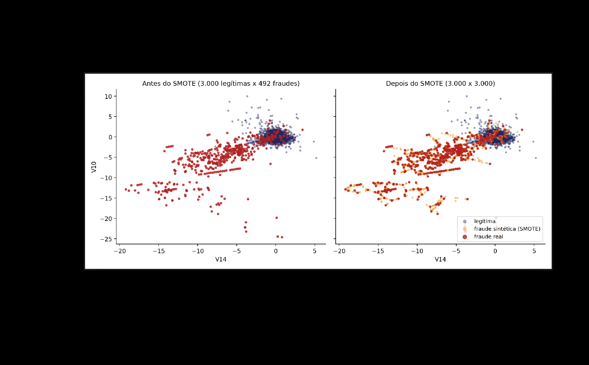
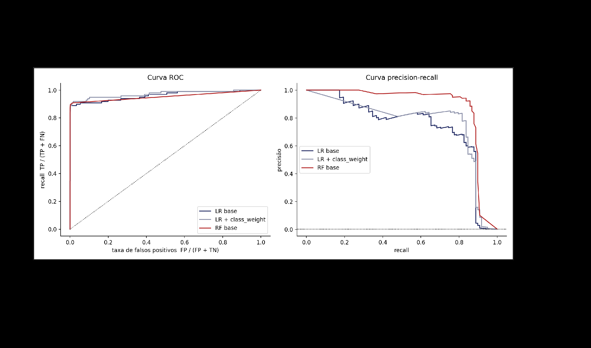

# Aula 08 — Meu modelo é bom? (avaliação de modelos)

## p01 · Capa

```text
analista@insper:~$ python avaliar.py --model rf
report> acurácia: 0.9996
report> precisão: 0.941 · recall: 0.816
report> f1: 0.874
# a acurácia esconde tudo
>>> confusion_matrix(y_test, y_pred)
[[56859     5]
 [   18    80]]
>>>
```

> A matriz da capa é a do **RF base**: TN=56.859, FP=5, FN=18, TP=80.

**Parte 1** — Demonstração da Aula 7: o que cada técnica de balanceamento faz com as contagens.
**Parte 2** — Dar nome às contagens: matriz de confusão, precisão, recall, F1, treino versus teste, curvas ROC e PR.

## p02 · Por que a fronteira se acomoda — *PARTE 1 · A DEMONSTRAÇÃO · MODELO BASE*

**Regressão logística, sem tratamento**
- **62 / 98** fraudes detectadas
- **13** alarmes falsos
- **36 (37%)** fraudes perdidas

**O mecanismo — o otimizador vai para onde dói menos**: o otimizador minimiza o **erro total**. Errar uma fraude custa o mesmo que errar uma legítima, e há 578 legítimas para cada fraude. A fronteira se acomoda do lado que dói menos: **o da maioria**.

## p03 · Técnica 1 · Undersampling aleatório — Jogar fora a maioria

Descartar transações legítimas do treino, ao acaso, até que as classes fiquem **1:1**. O conjunto de teste não é tocado.

- **788** linhas de treino (de 227.845)
- **90 / 98** fraudes detectadas
- **1.655** alarmes falsos (eram 13)

| O que ganhou | O que perdeu |
|---|---|
| Treino instantâneo. A fronteira se deslocou para o lado das legítimas e passou a capturar quase todas as fraudes. | **99,8% do conhecimento** sobre o que é "normal". Tudo que foge um pouco do padrão dos 394 legítimos restantes vira suspeito. |

## p04 · Técnicas 2 e 3 · Oversampling e SMOTE — Duplicar ou inventar fraudes

**Oversampling aleatório · 90/98 · 1.383 alarmes** — Copia fraudes existentes até 1:1. **Nenhuma informação nova.**

**SMOTE · Chawla et al., 2002 · 90/98 · 1.453 alarmes** — Para cada fraude, escolhe um dos **5 vizinhos mais próximos** e cria um ponto no segmento entre os dois.

- Onde fraudes reais estão isoladas, o SMOTE **atravessa regiões vazias e ensina fraude onde nunca houve**.
- Vizinhos por distância euclidiana: **escalar antes, ou `Time` domina tudo**. Supõe features contínuas.

> **FIGURA** — (é a mesma figura da Aula 7 p09) Par de scatters, eixos `V14` (x, −20 a +5) × `V10` (y, −25 a +10). Legenda: legítima (azul-marinho), fraude sintética SMOTE (laranja), fraude real (vermelho).
> **Esquerda — "Antes do SMOTE (3.000 legítimas x 492 fraudes)"**: legítimas num blob compacto em torno de (0,0); fraudes reais numa faixa alongada de (−4,−2) até (−19,−13), com outliers isolados em (−5,−23), (0,−20) e (0,5,−25).
> **Direita — "Depois do SMOTE (3.000 x 3.000)"**: os pontos laranja formam cordões retos ligando aglomerados vermelhos distantes, atravessando regiões antes **vazias**, e alguns invadem a borda do blob das legítimas.
> **O que a figura prova**: o SMOTE interpola, não observa — carimba "fraude" em território onde nunca houve fraude.
> 
>
> *Legenda do slide: "PONTOS LARANJA: FRAUDES SINTÉTICAS INTERPOLADAS ENTRE FRAUDES REAIS"*

## p05 · Técnica 4 · Ponderação de classes — Sem reamostrar: mudar o custo

Em vez de mexer nos dados, dizer ao modelo que errar uma fraude custa mais: `class_weight="balanced"` multiplica o peso de cada fraude por **578** na função de custo.

| ESTRATÉGIA | LINHAS DE TREINO | DETECTADAS | ALARMES FALSOS | TEMPO |
|---|---|---|---|---|
| Oversampling aleatório | 454.902 | 90 / 98 | 1.383 | 2,9 s |
| `class_weight="balanced"` | 227.845 | 90 / 98 | 1.386 | 0,7 s |

- Duplicar cada fraude 578 vezes ou multiplicar seu peso por 578 é, **para a regressão logística, a mesma conta**.
- Sem 454 mil linhas na memória, sem dados sintéticos, sem risco de vazamento. Em muitos cenários reais é a primeira coisa a tentar, e às vezes a última.
- Modelos de árvore (Random Forest, XGBoost) também aceitam pesos de classe.

## p06 · O mesmo trade-off, de quatro jeitos — *CINCO ESTRATÉGIAS, UM MESMO CONJUNTO DE TESTE*

| ESTRATÉGIA | DETECTADAS | ALARMES POR FRAUDE |
|---|---|---|
| Base (sem tratamento) | 62 / 98 | 0,2 |
| Undersampling | 90 / 98 | 18,4 |
| Oversampling | 90 / 98 | 15,4 |
| SMOTE | 90 / 98 | 16,1 |
| `class_weight` | 90 / 98 | 15,4 |

Quatro técnicas, um mesmo trade-off: **90 detectadas ao custo de 1.400 a 1.700 alarmes**. Qual venceu? **Depende do custo de cada erro, que o dataset não contém.**

## p07 · Armadilha 1 · SMOTE antes do split — Quando o resultado é bom demais

Reamostrar o dataset inteiro e **só depois** dividir em treino e teste.

- **55.171** "fraudes" detectadas no teste
- **97%** de recall aparente

- O teste tem **56.863 "fraudes"**: quase todas sintéticas, interpoladas a partir de fraudes que **também estão no treino**.
- O modelo é avaliado em pontos que ficam no meio do caminho entre exemplos que ele já viu: **vazamento**. O teste deixou de representar o mundo (0,17% de fraude, todas genuínas).

**REGRA**: reamostragem só no treino, **sempre depois do split**. O `Pipeline` do `imbalanced-learn` faz isso sozinho.

## p08 · Armadilhas 2 e 3 · Quando o número engana — Teste na proporção errada

Undersampling do dataset inteiro (**492 × 492**) e avaliação nesse conjunto.

- **93 / 98** fraudes detectadas
- **2** alarmes falsos em 99 legítimas
- **≈ 1.150** seriam os alarmes em 56.864 legítimas

**Armadilha 2**: parece o melhor modelo do dia — é o undersampling do item d), maquiado. Os alarmes "sumiram" porque só havia 99 legítimas para errar. Na proporção real, seriam mais de mil. **Regra: o teste tem de ter a proporção real das classes.**

**Armadilha 3, sutil**: SMOTE **sem escalar**. Os vizinhos passam a ser definidos por `Time` e o resultado (**88 detectadas, 568 alarmes**) vem de outro algoritmo.

## p09 · Cinco lições da Parte 1 — *O QUE LEVAR DA DEMONSTRAÇÃO*

1. **Acurácia não é métrica para classes raras** — Sempre reportar fraudes detectadas e alarmes falsos. Os nomes formais chegam na Parte 2.
2. **Reamostragem só no treino, depois do split** — E o teste com a proporção real. Use o `Pipeline` do `imbalanced-learn`.
3. **Balancear é mover a fronteira** — Undersampling, oversampling, SMOTE e pesos são quatro jeitos de fazer a mesma coisa. Nem sempre ajudam. **O limiar é a alavanca mais barata.**
4. **Não há vencedor sem custos** — Qual erro dói mais? A resposta vem do negócio, não do dataset. Roteiro 3.
5. **Fraude se move** — Um modelo de 2013 não detecta a fraude de 2026. Monitoramento e retreino: Aula 20.

## p10 · [divisória] PARTE 2 — Dar nome às contagens

Fraudes detectadas, fraudes perdidas e alarmes falsos têm **nomes formais desde 1950**. Hoje vocês calculam à mão, depois o notebook confirma.

> *(Imagem de fundo: foto vintage de um operador de radar diante de uma tela circular verde, em uma console de mostradores analógicos. Decorativa, mas alusiva — a curva ROC, "Receiver Operating Characteristic", nasceu na análise de operadores de radar.)*

## p11 · As contagens de seis modelos — *EXERCÍCIO RELÂMPAGO · CALCULE À MÃO*

| MODELO | TP | FN | FP | TN |
|---|---|---|---|---|
| Nulo | 0 | 98 | 0 | 56.864 |
| LR base | 62 | 36 | 13 | 56.851 |
| LR + undersampling | 90 | 8 | 1.655 | 55.209 |
| LR + SMOTE | 90 | 8 | 1.453 | 55.411 |
| LR + `class_weight` | 90 | 8 | 1.386 | 55.478 |
| RF base | 80 | 18 | 5 | 56.859 |

**Para cada linha**
- `P = TP / (TP + FP)`
- `R = TP / (TP + FN)`
- `F1 = 2·P·R / (P + R)`
- `Acc = (TP + TN) / 56.962`

Depois: ordene os seis modelos por F1 e por recall.

*10 minutos, em dupla, sem computador. A pergunta que importa: **os dois rankings coincidem?***

## p12 · A matriz de confusão, com nomes — Quatro quadrantes, duas perguntas

| | PREVISTO: FRAUDE | PREVISTO: LEGÍTIMA |
|---|---|---|
| **REAL: FRAUDE** | Verdadeiro positivo — `TP · FRAUDE DETECTADA` | Falso negativo — `FN · FRAUDE PERDIDA` |
| **REAL: LEGÍTIMA** | Falso positivo — `FP · ALARME FALSO` | Verdadeiro negativo — `TN · LEGÍTIMA APROVADA` |

- **Recall**: `TP / (TP + FN)`. A **linha de cima**. *"Das fraudes, quantas pegamos?"*
- **Precisão**: `TP / (TP + FP)`. A **coluna da esquerda**. *"Dos alertas, quantos valeram?"*
- **F1**: média harmônica das duas. Pune quem sacrifica uma delas.
- **Acurácia**: as duas diagonais (TP e TN — *"as duas diagonais azuis"*, destacadas em azul no slide) sobre o total. **Dominada pelo TN.**

## p13 · A métrica decide o vencedor — *REVELAÇÃO · DOIS RANKINGS QUE NÃO COINCIDEM*

| MODELO | ACURÁCIA | PRECISÃO | RECALL | F1 |
|---|---|---|---|---|
| RF base | 99,96% | 0,941 | 0,816 | 0,874 |
| LR base | 99,91% | 0,827 | 0,633 | 0,717 |
| LR + `class_weight` | 97,55% | 0,061 | 0,918 | 0,114 |
| LR + SMOTE | 97,43% | 0,058 | 0,918 | 0,110 |
| LR + undersampling | 97,08% | 0,052 | 0,918 | 0,098 |
| Nulo | 99,83% | 0,000 | 0,000 | 0,000 |

- **Acurácia**: entre 97% e 99,96% para todos. **Não separa o nulo do melhor. Descartada.**
- **Recall × F1**: as balanceadas lideram em recall (0,92) e afundam em F1 (0,10): precisão de 5%. **O F1 pune o desequilíbrio.**
- **Mas F1 assume pesos iguais**: fraude perdida e alarme falso não custam o mesmo. Roteiro 3.

## p14 · Três conjuntos, um só medidor honesto — *TREINO, VALIDAÇÃO E TESTE*

**TREINO** (aprender: o modelo ajusta seus parâmetros aos dados) → **VALIDAÇÃO** (escolher: profundidade, número de árvores, limiar) → **TESTE** (medir uma vez: uma única medição, no fim de tudo)

- Métrica de treino mede **o que o modelo decorou**, não o que aprendeu.
- Toda escolha feita olhando o teste transforma o teste em validação; **sobra nada para medir**.
- Com dados que têm tempo (logs, transações), a divisão honesta é **temporal**: treinar no passado, validar e testar no futuro. Validação cruzada é a alternativa quando os dados são poucos; em dados temporais, **só a versão que respeita a ordem**.

## p15 · A distância entre treino e teste — *OVERFITTING COMO NÚMERO*

| MODELO | CONJUNTO | PRECISÃO | RECALL | F1 |
|---|---|---|---|---|
| LR base | treino | 0,883 | 0,629 | 0,735 |
| LR base | teste | 0,827 | 0,633 | 0,717 |
| RF base | treino | 1,000 | 0,995 | 0,997 |
| RF base | teste | 0,941 | 0,816 | 0,874 |

- **Random Forest**: recall **0,995 no treino** — decorou as 394 fraudes. A queda para **0,816 no teste** é o overfitting, **medido**.
- **Regressão logística**: treino e teste quase iguais — 30 coeficientes não têm capacidade para decorar. **Ruim nos dois seria underfitting.**

## p16 · Uma curva por limiar — *CURVAS ROC E PRECISION-RECALL*

- **ROC** — Recall contra taxa de falsos positivos. **1.400 alarmes em 56.864 legítimas são 2,5%: a ROC não vê.**
- **Precision-Recall** — Precisão contra recall. **Aqui os modelos se separam.**
- Onde operar na curva e quanto vale a área sob ela: pergunta do Roteiro 3.

*Cada ponto é um limiar sobre `predict_proba` · a linha pontilhada da PR é o acaso (0,17%).*

> **FIGURA** — Dois painéis, três modelos em cada (LR base = azul-marinho; LR + class_weight = azul-acinzentado; RF base = vermelho).
> **Painel esquerdo, "Curva ROC"** — eixo x `taxa de falsos positivos FP/(FP+TN)` (0→1), eixo y `recall TP/(TP+FN)` (0→1); diagonal pontilhada = acaso. **As três curvas sobem quase verticalmente até recall ≈ 0,88-0,90 com FPR ≈ 0 e depois percorrem o topo praticamente coladas, entre 0,9 e 1,0** — visualmente indistinguíveis. Todas parecem excelentes.
> **Painel direito, "Curva precision-recall"** — eixo x `recall` (0→1), eixo y `precisão` (0→1); linha pontilhada rente ao zero = acaso (0,17%). **Aqui as curvas se separam claramente**: RF base (vermelho) mantém precisão ~1,0 até recall ≈ 0,75 e só despenca perto de recall 0,9; LR base e LR + class_weight caem cedo, oscilando entre 0,8 e 0,65 já a partir de recall 0,2-0,6, e desabam para ~0 em recall ≈ 0,9. O RF domina as outras duas em quase toda a faixa.
> **O que a figura prova**: com 578:1, a ROC é cega — o denominador dela (TN = 56.864) engole os 1.400 falsos positivos. A curva PR usa FP contra TP e por isso expõe a diferença real entre os modelos. **É a comparação visual que justifica a regra "use PR, não ROC, em classes raras".**
> 

## p17 · Quatro ideias para levar — *O QUE LEVAR · E O EXERCÍCIO ASSÍNCRONO*

1. Acurácia está descartada para classes raras. **Recall e precisão** são as duas contagens da Aula 8 com nome.
2. **F1 pune o desequilíbrio**, mas assume que os dois erros custam o mesmo.
3. Métrica de treino não é desempenho. Escolhas exigem validação, **temporal quando há tempo**.
4. **ROC é cega ao desbalanceamento; a curva PR não.** Onde operar nela: Roteiro 3.

**Exercício assíncrono · meia página por dupla, sem nota**: precisão, recall, F1 e matriz de confusão do Random Forest do Roteiro 2 (CICIDS2017), no teste do split temporal. Uma frase: qual métrica você reportaria ao SOC e por quê. **Leitura**: Géron, cap. 3.
