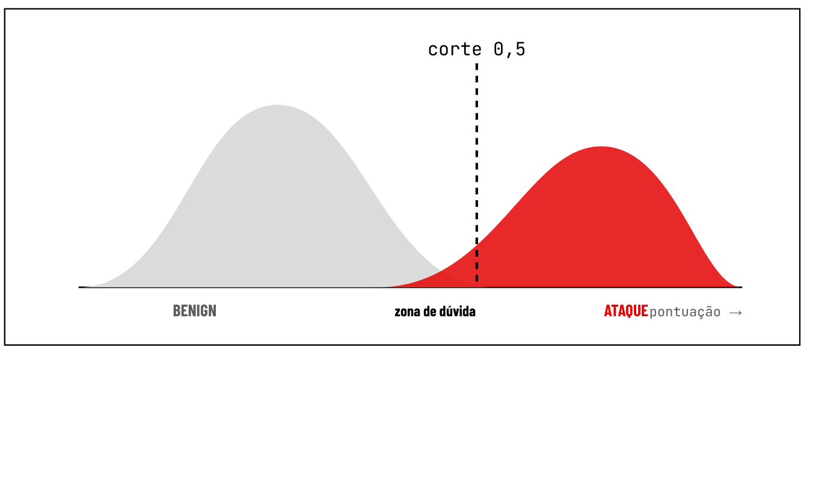
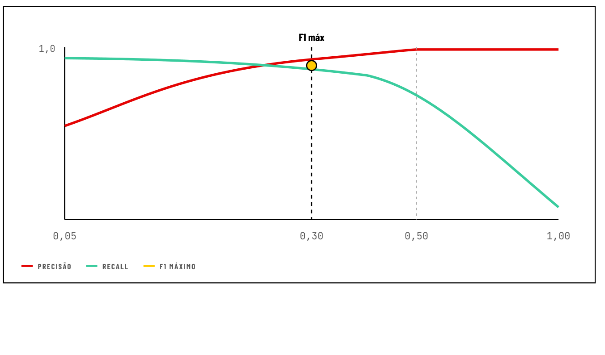
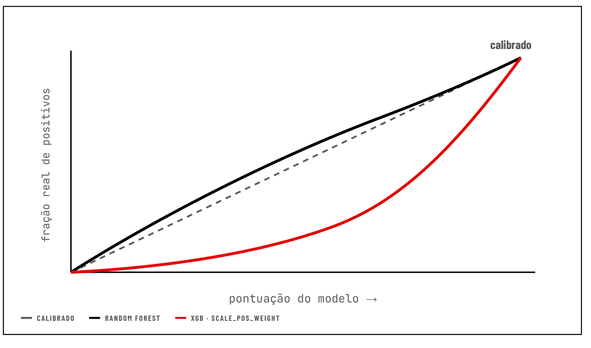
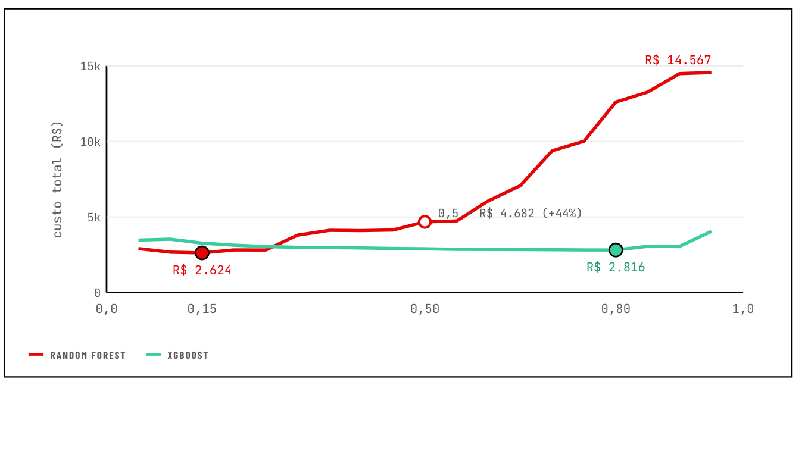
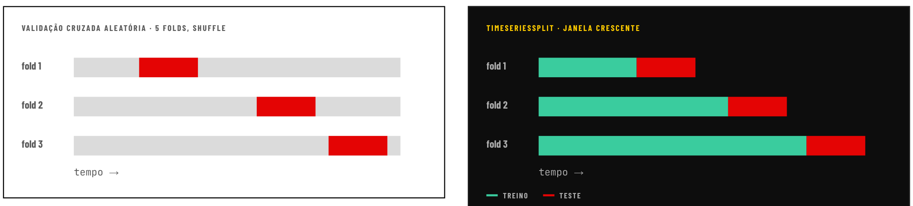

# Aula 09 — Da pontuação à decisão: limiar, custo, validação e viés

## p01 · Capa

*Rótulo do bloco de código: `python3 · sklearn · threshold sweep`*

```python
>>> y_score = model.predict_proba(X)[:, 1]
>>> for t in [0.15, 0.30, 0.50, 0.80]:
...     p, r = pr_at(y, y_score, t)
...     custo = fp(t)*12 + fn(t)*2500
t=0.15  P=0.71  R=0.90  custo=R$ 2.624  ← min
t=0.30  P=0.86  R=0.85  custo=R$ 3.100
t=0.50  P=1.00  R=0.70  custo=R$ 4.682
t=0.80  P=1.00  R=0.55  custo=R$ 6.900
# o modelo dá a pontuação · você escolhe o corte
>>> _
```

> Esta tabela da capa é o resumo de toda a aula: **mesmo modelo, quatro limiares, quatro custos diferentes**. O mínimo está em t=0,15, não no default 0,5.

## p02 · Onde estamos: da medida à decisão — *01 · ABERTURA*

> O modelo devolve uma pontuação. **Hoje decidimos o corte.**

| Roteiro 1 | Roteiro 2 | Aula passada | **HOJE · AVALIAÇÃO** |
|---|---|---|---|
| Regras à mão | Classificador + split temporal | Matriz, P/R/F1, ROC × PR | Limiar, custo, validação, viés |
| Detecção escrita como regras explícitas. | Modelo que devolve uma pontuação. | Como medir um classificador. | Como transformar medida em decisão. |

- O modelo do Roteiro 2 devolve uma pontuação. Alguém decidiu que **0,5** é o corte. Hoje discutimos **quem decide isso e com que critério**.
- Três perguntas do gestor: **quantos alertas vou receber**, **quanto custa cada erro**, e **o número que você me mostrou vale para a semana que vem?**

*A avaliação intermediária é assíncrona, individual ou em dupla, e reaproveita o modelo do Roteiro 2 · não pede modelo novo.*

## p03 · Uma noite no SOC — *02 · MOTIVAÇÃO · O TURNO DA NOITE, ANTES DE QUALQUER MODELO*

- **10.000** alertas por dia em um SOC de porte médio
- **8 min** de um analista N1 por alerta triado
- **> 160** analistas necessários para triar tudo

**O que acontece de verdade**
- O time desliga regras barulhentas e sobe limiares até o volume caber
- Alertas viram fila; a fila vira ignorar
- O ataque real chega junto com 300 falsos e passa

**A pergunta que o modelo não responde**
- Onde cortar a pontuação para que o volume caiba no time
- Quanto vale um ataque que passa, comparado a 8 minutos de analista
- Esses dois números decidem o limiar; **o modelo só fornece a pontuação**

## p04 · A falácia da taxa-base — *03 · TAXA-BASE · STALLINGS*

| O cenário | A conta |
|---|---|
| 1 ataque a cada 10.000 fluxos · prevalência **0,01%** | Ataques detectados: **0,99** |
| Detector com recall de **99%** | Alertas falsos: 1% de 9.999 ≈ **100** |
| Taxa de falsos positivos de apenas **1%** | Precisão: 0,99 ÷ 101 ≈ **1%** |

⇒ **1%** dos alertas são ataques reais.

Um detector "99% / 1%" é excelente no laboratório e **inútil no turno da noite**. Quanto mais rara a classe, menos a ROC enxerga o problema · **a curva Precision-Recall é a curva do SOC**.

## p05 · O modelo não decide. O limiar decide. — *04 · LIMIAR*

*(O 0,5 é o default da biblioteca, não uma decisão de segurança.)*

**Como ler**
- `predict()` = `predict_proba()` ≥ 0,5. O 0,5 é o default da biblioteca, **não uma decisão de segurança**.
- Se o corte passa por uma região povoada, **cada centésimo de limiar move alertas de lado**.
- O limiar é um **botão de operação**. Quem gira é quem sabe o custo do erro e o tamanho do time.

*Item b) · desenhe esse histograma com o seu modelo*

> **FIGURA (esquemática, vetorial)** — Histograma de densidade da pontuação do modelo, eixo x `pontuação →`. Duas distribuições em forma de sino: **BENIGN** (cinza) centrada à esquerda, **ATAQUE** (vermelha) centrada à direita, com **sobreposição parcial** no meio rotulada **"zona de dúvida"**. Uma linha vertical tracejada rotulada **"corte 0,5"** cai bem dentro da região vermelha — à esquerda do pico do ataque —, cortando a zona de dúvida.
> **O que a figura prova**: as duas classes não são separáveis por um ponto; existe uma faixa onde os dois sinos coexistem. Onde a linha cai nessa faixa é uma escolha, e deslocá-la troca FP por FN continuamente.
> 

## p06 · Varredura de limiar — *04.1 · VARREDURA · O MESMO MODELO, DEZENOVE DECISÕES*

**Leitura**
- De **0,05 a 0,20** a precisão vai de **0,54 a 0,90** e o recall quase não cai
- Acima de **0,50**: precisão **1,0**, recall despencando
- **F1 máximo em 0,30**
- Nenhum desses pontos é "o certo" sem saber o que cada erro custa

*Item d) · `varrer_limiares()` reutilizável*

> **FIGURA (esquemática, vetorial)** — Eixo x = limiar, com marcas em 0,05 · 0,30 · 0,50 · 1,00; eixo y de 0 a 1,0. Duas curvas: **PRECISÃO** (vermelha) sobe de ~0,54 em 0,05, cruza a curva de recall pouco antes de 0,30 e satura em 1,0 a partir de ~0,50, mantendo-se plana até 1,00. **RECALL** (verde) parte de ~0,97 em 0,05, fica quase plano até ~0,35 e então cai progressivamente, despencando após 0,50 até ~0,35 em 1,00. Um ponto amarelo circulado marca **F1 máx** em 0,30, com linha vertical tracejada; uma segunda linha vertical cinza pontilhada marca 0,50.
> **O que a figura prova**: existe uma faixa barata (0,05→0,20) onde se ganha muita precisão quase de graça, e uma faixa cara (>0,50) onde só se perde recall. O F1 máximo (0,30) é um ponto entre eles — mas nenhum é "o certo" sem o custo.
> 

## p07 · As duas áreas discordam — *05 · COMPARAÇÃO · ROC E PR DISCORDAM · EM QUAL VOCÊ ACREDITA?*

| MODELO | ROC-AUC | PR-AUC | FP EM 0,5 | FN EM 0,5 | PRECISÃO 0,5 | RECALL 0,5 |
|---|---|---|---|---|---|---|
| Random Forest | 0,937 | 0,814 | 0 | 32 | 1,000 | 0,704 |
| XGBoost | 0,985 | 0,803 | 24 | 25 | 0,776 | 0,769 |

**O 0,5 não é o mesmo 0,5**
- RF em 0,5: **nenhum alerta falso, 32 fraudes passam**
- XGB em 0,5: **24 alertas falsos, 25 fraudes passam**
- `scale_pos_weight` empurra as pontuações do XGB para cima

**Por que discordam**
- ROC: eixo x é FP ÷ 85.331 legítimas · 24 falsos positivos **não movem nada**
- PR: eixo y é TP ÷ alertas · 24 falsos positivos em 107 alertas **movem muito**
- Com 0,13% de prevalência, a PR é a curva do SOC · itens c) e g)

**Consequência**
- Comparar modelos no corte 0,5 é **comparar dois limiares diferentes**
- O XGB "ganha" na ROC e "perde" na PR · **nenhum número está errado**
- A pergunta certa é **qual eixo reflete o custo do seu turno**

## p08 · Calibração · 0,5 não quer dizer 50% — *06 · CALIBRAÇÃO*

**Três regras**
- Um modelo é **calibrado** quando, entre os pontuados com 0,7, cerca de **70%** são positivos.
- **Regra 1** · nunca comparar modelos em um corte fixo; comparar pela varredura.
- **Regra 2** · se a pontuação vira probabilidade (custo esperado por alerta), **calibrar antes**: `CalibratedClassifierCV`.
- **Regra 3** · **retreinou, recalibrou.** A escala muda com o modelo.

> **FIGURA (esquemática, vetorial)** — Diagrama de confiabilidade: eixo x `pontuação do modelo →`, eixo y `fração real de positivos`. Três curvas: **CALIBRADO** = diagonal cinza tracejada (referência y=x); **RANDOM FOREST** (preta) fica **acima** da diagonal em toda a faixa (côncava, subestima — pontuação 0,4 corresponde a uma fração real maior que 0,4) e reencontra a diagonal no canto superior direito, onde está o rótulo "calibrado"; **XGB · SCALE_POS_WEIGHT** (vermelha) fica **bem abaixo** da diagonal, quase colada ao eixo x até a metade e só sobe abruptamente no fim — convexa, superestima fortemente.
> **O que a figura prova**: a mesma pontuação "0,5" significa coisas diferentes em cada modelo. O `scale_pos_weight` do XGB inflou as pontuações e destruiu a calibração, então usá-las como probabilidade num cálculo de custo esperado daria número errado.
> 

## p09 · Matriz de custo — *07 · CUSTO · CADA ERRO TEM UM PREÇO*

```text
custo total = FP × C_FP + FN × C_FN
```

| CENÁRIO | FALSO POSITIVO CUSTA | FALSO NEGATIVO CUSTA | RAZÃO C_FN ÷ C_FP |
|---|---|---|---|
| SOC de intrusão · Parte A | R$ 12 · 8 min de analista N1 | R$ 2.500 · contenção de incidente | ≈ 200 |
| Fraude em cartão · Parte B | R$ 5 · confirmar com o cliente | Valor da transação que passou · `Amount` | varia por linha |

**O que o modelo dá e o que o negócio dá**
- Modelo: TP, FP, FN para cada limiar · a varredura
- Negócio: `C_FP` e `C_FN`, **estimados e discutíveis**
- Junte os dois e o limiar deixa de ser opinião

**Custos são hipóteses**
- Sempre testar a **sensibilidade**: e se `C_FN` for 5× maior?
- Se a resposta não muda, a decisão é **robusta**
- Se muda, **o gestor precisa decidir o custo, não o limiar**

## p10 · Custo contra limiar — *07.1 · CUSTO · ONDE O DINHEIRO É MÍNIMO*

**Leitura**
- **RF**: mínimo **R$ 2.624 em 0,15**; em 0,5 custa **R$ 4.682 · +44%**
- **XGB**: mínimo **R$ 2.816 em 0,80**
- Os **degraus** são fraudes caras mudando de lado
- F1 máximo do RF era **0,30**; custo mínimo é **0,15** · **F1 conta fraudes, custo conta reais**

*Item h)*

> **FIGURA (vetorial, valores reais)** — Eixo x = limiar (0,0 · 0,15 · 0,50 · 0,80 · 1,0), eixo y = `custo total (R$)` de 0 a 15k.
> **RANDOM FOREST (vermelho)**: começa ~R$ 2.900 em 0,05, atinge o **mínimo marcado R$ 2.624 em 0,15**, sobe em patamares até ~R$ 4.200 em 0,35, passa pelo ponto circulado **0,5 · R$ 4.682 (+44%)**, e depois **dispara em degraus** — ~R$ 7.000 em 0,65, ~R$ 10.000 em 0,75, ~R$ 12.500 em 0,82 — terminando em **R$ 14.567**.
> **XGBOOST (verde)**: praticamente **plano** em ~R$ 2.800-3.500 por toda a faixa, com mínimo marcado **R$ 2.816 em 0,80**, subindo só levemente para ~R$ 4.000 no extremo direito.
> **O que a figura prova**: (1) a curva de custo tem mínimo, e ele não está em 0,5 — operar no default custa 44% a mais no RF; (2) os dois modelos têm mínimos parecidos (R$ 2.624 vs R$ 2.816) mas em limiares opostos (0,15 vs 0,80), o que confirma a p07: comparar no mesmo corte é comparar coisas diferentes; (3) a curva do RF é muito mais sensível ao limiar que a do XGB.
> 

## p11 · Quatro limiares, uma restrição — *08 · CAPACIDADE · A RESTRIÇÃO QUE O CUSTO NÃO VÊ*

| CORTE 0,5 — o default | F1 MÁXIMO — equilíbrio | CUSTO MÍNIMO — minimiza reais | CABE NO TIME — operacional |
|---|---|---|---|
| Nenhum argumento além de "veio assim". | Equilibra precisão e recall. Ignora que os erros custam diferente. | Pode gerar mais alertas do que o time consegue triar. | Menor custo **entre os limiares cujo volume cabe no time**. É o candidato operacional. |

**A conta da fila**
- `alertas = TP + FP`
- Se `alertas > capacidade`, o excedente vira fila
- E **fila vira falso negativo não contabilizado**

**Quando conflitam**: quando custo mínimo e capacidade conflitam, o limiar não resolve — é **decisão de gestão**: mais analistas, automação de triagem, ou aceitar o recall que cabe.

*Item e) · os quatro limiares lado a lado*

## p12 · Dois limiares, três faixas — *09 · SEVERIDADE · SEVERIDADE EM VEZ DE SIM OU NÃO*

| ≥ limiar alto — Resposta automática | entre os dois — Fila do analista | < limiar baixo — Só log |
|---|---|---|
| Bloquear, isolar, pedir segundo fator. Escolhido pela **precisão** · quase nenhum FP pode virar bloqueio. | Triagem humana. É a **única faixa limitada pela capacidade** do time. | Sem ação; fica para investigação retroativa. Escolhido pelo **recall** · é o que se aceita perder. |

A capacidade restringe **só a faixa do meio**. A automação de triagem · inclusive com IA generativa · alarga essa faixa sem contratar; voltamos a isso mais adiante no curso.

## p13 · Validação · o número honesto — *11 · VALIDAÇÃO · O NÚMERO QUE VOCÊ REPORTARIA*

| Validação cruzada estratificada · aleatória | Split temporal |
|---|---|
| 5 folds, shuffle, `random_state` da dupla | Treina no passado, testa no futuro · 70% iniciais por dia |
| Cada fold mistura início e fim de campanha | Reproduz o que o SOC vai ver na semana que vem |
| **Boa para**: escolher hiperparâmetros, medir variância | Estimativa **mais baixa e mais honesta** |
| **Ruim para**: prometer desempenho ao SOC | Versão com vários folds: `TimeSeriesSplit` |

- Roteiro 2: **Bot com recall 0,96 no split aleatório e 0,16 no temporal**. O mesmo modelo, a mesma classe.
- A diferença entre as duas estimativas é uma **medida do drift dentro do dataset** · é o que o Roteiro 5 vai monitorar em produção.

*Item f): as duas PR-AUC, lado a lado, e a explicação do gap.*

## p14 · TimeSeriesSplit · janela crescente — *11.1 · VALIDAÇÃO · VÁRIOS FOLDS, TODOS HONESTOS*

> **FIGURA (esquemática, vetorial)** — Dois painéis de barras horizontais, ambos com eixo `tempo →`. Legenda: verde = TREINO, vermelho = TESTE.
> **Esquerda, "VALIDAÇÃO CRUZADA ALEATÓRIA · 5 FOLDS, SHUFFLE"** (fundo branco): três barras cinza de comprimento total igual; o bloco vermelho de teste aparece **em posição diferente no meio de cada barra** — fold 1 no primeiro terço, fold 2 no meio, fold 3 no fim — com cinza (treino) **dos dois lados**. Ou seja: em todo fold o treino inclui dados posteriores ao teste.
> **Direita, "TIMESERIESSPLIT · JANELA CRESCENTE"** (fundo preto): três barras que **crescem** de cima para baixo; cada uma é verde (treino) desde o início do tempo e termina com um bloco vermelho (teste) **imediatamente à direita** do treino. O treino do fold 2 inclui o teste do fold 1, e assim por diante. Nenhum vermelho fica à esquerda de verde.
> **O que a figura prova**: a validação cruzada aleatória treina com o futuro em todos os folds; o `TimeSeriesSplit` nunca faz isso — daí a diferença sistemática entre as duas estimativas.
> 

Média e desvio como na validação cruzada, **sem treinar com o futuro**. Os primeiros folds têm pouco dado, então a variância é maior · é o regime que mais se parece com **retreinar toda semana e avaliar na seguinte**.

## p15 · Limitações e viés — *12 · VIÉS · LIMITAÇÕES E VIÉS EM MODELOS DE SEGURANÇA*

| FONTE DE VIÉS OU LIMITAÇÃO | COMO APARECE | ONDE ESTÁ NOS NOSSOS DADOS |
|---|---|---|
| **Taxa-base** | Precisão desaba quando a classe é rara | 0,13% de fraudes; ataques raros no CICIDS |
| **Viés de rótulo** | O rótulo vem de um detector anterior; o que ele não viu vira "legítimo" | Fraudes não contestadas marcadas como `Class = 0` |
| **Origem de laboratório** | Rótulo perfeito, tráfego irreal, sem ruído de produção | CICIDS2017 é tráfego gerado na UNB |
| **Drift** | O padrão muda no tempo; o modelo envelhece | Bot no fim da campanha; 2 dias de cartão em 2013 |
| **Erro desigual** | O custo dos FP recai sobre um grupo | FP concentrados em certas horas e faixas de valor |

*Item i): recall por faixa de valor, FP por hora, e três limitações do dataset que impedem generalizar para um banco brasileiro hoje.*

**Governança**: NIST AI RMF, função **MAP** · contexto, limitações e quem é afetado. Volta na Unidade 8.

## p16 · Da pontuação à decisão — *13 · SÍNTESE · O QUE LEVAR DESTA AULA*

1. O modelo entrega uma pontuação. **O limiar é uma decisão de negócio** com dois preços e uma capacidade.
2. **Precisão é o que o analista sente**; a curva PR é a curva do SOC.
3. Custo mínimo e capacidade são **restrições diferentes**; quando conflitam, é decisão de gestão.
4. **O número honesto é o do split temporal.** A validação cruzada aleatória vê o futuro.
5. Todo dataset tem **viés de rótulo**: o que o detector anterior não viu está marcado como legítimo.

→ A avaliação intermediária reaproveita o modelo do Roteiro 2 · **itens b) a i)**.

**Leituras**: Chio & Freeman cap. 2 · Stallings, intrusos e falácia da taxa-base · Géron cap. 3 · NIST AI 100-2e2025
**Próxima aula**: Mini-CTF de detecção com os modelos das duplas. · `joaoealv@insper.edu.br`
